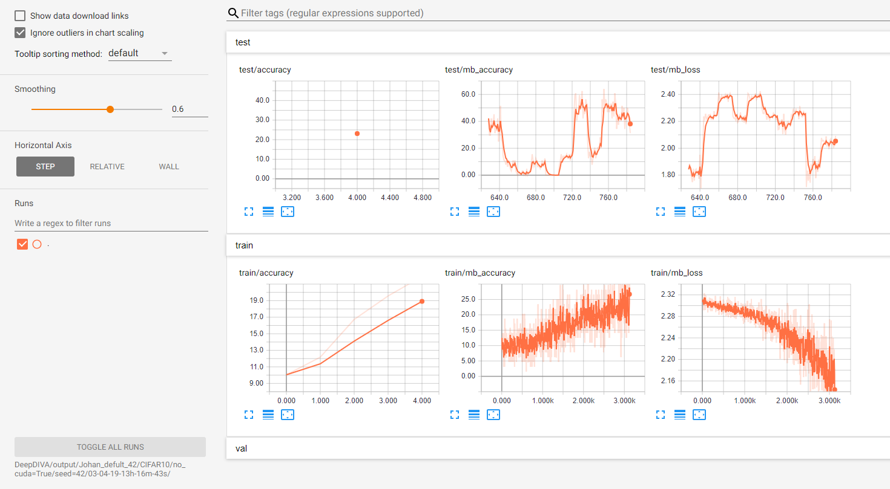
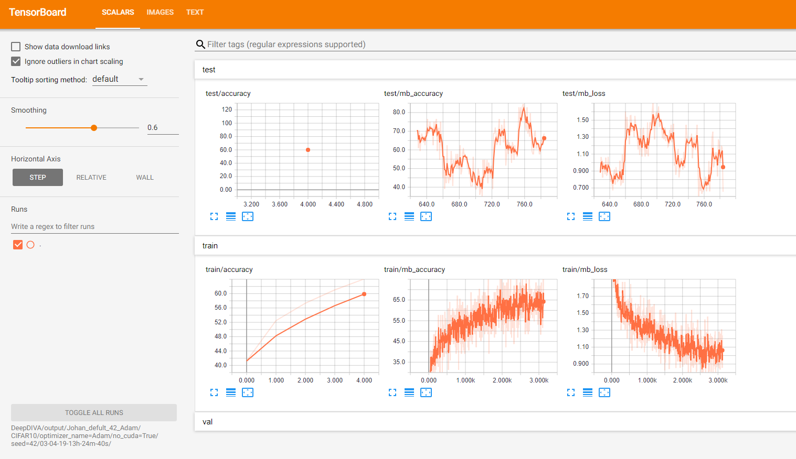
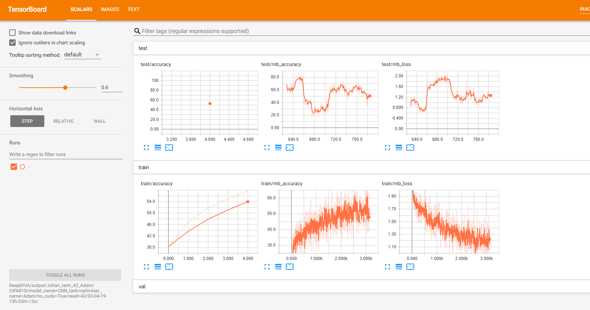

https://github.com/hyllevask/D7018E/blob/master/Assignment_1/Assignment%201.md

Run 1: 
Run CIFAR-10 out of the box with default parameters and seed 42

```shell
 python template/RunMe.py --dataset-folder datasets/CIFAR10/ --ignoregit --no-cuda \
    --seed 42
````


Run 2: 
Change the optimizer to Adam by command line option - otherwise run as above (1)

```shell
 python template/RunMe.py --dataset-folder datasets/CIFAR10/ --ignoregit --no-cuda \
    --seed 42 --optimizer-name Adam
````



Run 3:
Clone model CNN_basic.py and exchange LeakyReLu nonlinearity for tanh

```shell
 python template/RunMe.py --dataset-folder datasets/CIFAR10/ --ignoregit --no-cuda \
    --seed 42 --optimizer-name Adam --model-name CNN_tanhH
````



Authors: Johan Öhman, György Kovács and Rickard Brännvall
