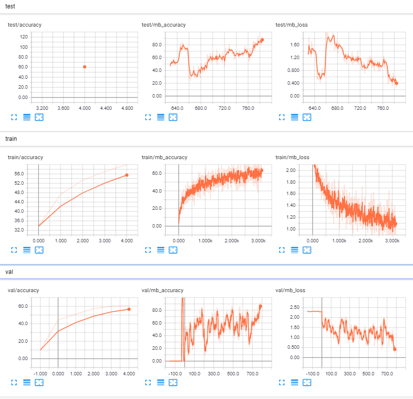
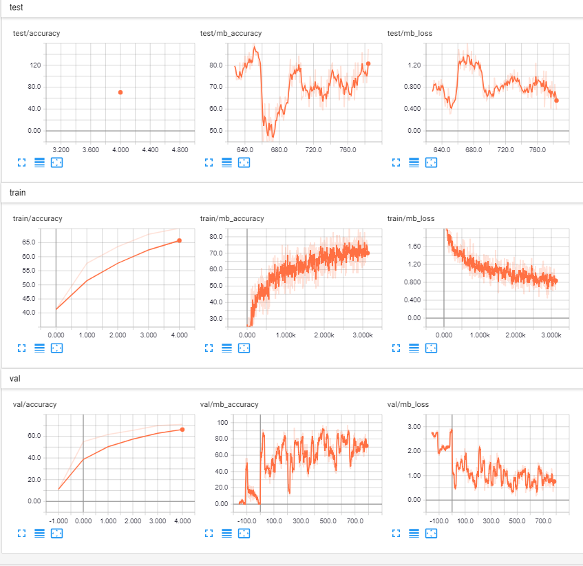
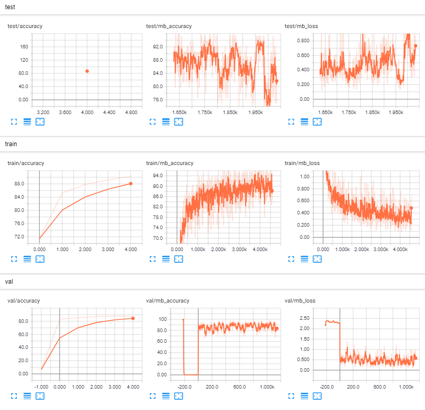
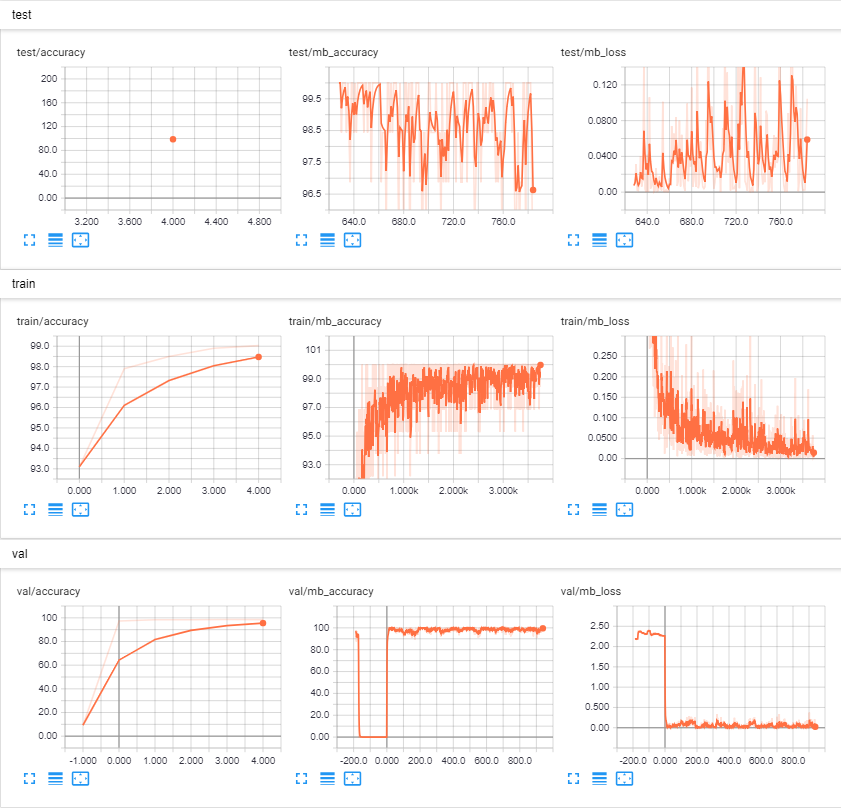
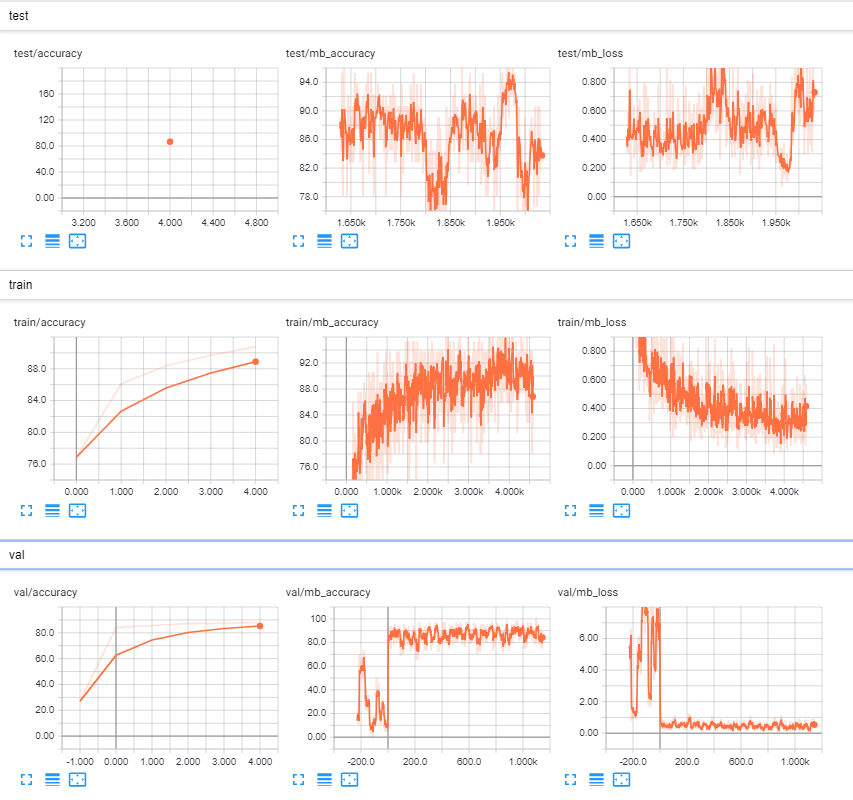

# TODO
 Write some small comments and answers to questions in the task.

# Train Alexnet from scratch on the CIFAR10 dataset
```shell
 python template/RunMe.py --output-folder output --dataset-folder datasets/CIFAR10
 --ignoregit --no-cuda --model-name alexnet --seed 42 --optimizer-name Adam
````
The accuracy was 60.75%





# Train Alexnet (pretrained on imagenet) on the CIFAR10 dataset
```shell
 python template/RunMe.py --output-folder output --dataset-folder datasets/CIFAR10
 --ignoregit --no-cuda --model-name alexnet --seed 42 --optimizer-name Adam --pretrained
````
The accuracy was 70.39%



# Train basic_CNN from scratch on SVHN dataset
```shell
python template/RunMe.py --output-folder output --dataset-folder datasets/SVHN
--ignoregit --no-cuda --model-name CNN_basic --seed 42 --optimizer-name Adam  
````
The accuracy was 86.67%




# Train basic_CNN from scratch on MNIST dataset
```shell
python template/RunMe.py --output-folder output --dataset-folder datasets/MNIST
--ignoregit --no-cuda --model-name CNN_basic --seed 42 --optimizer-name Adam  
````
The accuracy was 98.70%




# Train basic_cnn (pretrained on MNIST) on SVHN dataset
```shell
python template/RunMe.py --output-folder output --dataset-folder datasets/SVHN
--ignoregit --no-cuda --model-name CNN_basic --seed 42 --optimizer-name Adam --load-model
output/Johan_CNN_basic_MNIST2/MNIST/optimizer_name\=Adam/no_cuda\=True/seed\=42/03-05-19-09h-34m-59s/checkpoint.pth.tar  
````
The accuracy was 86.57%


