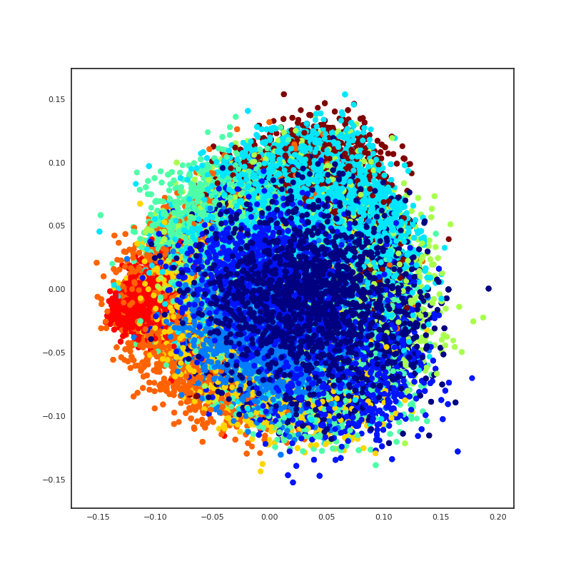
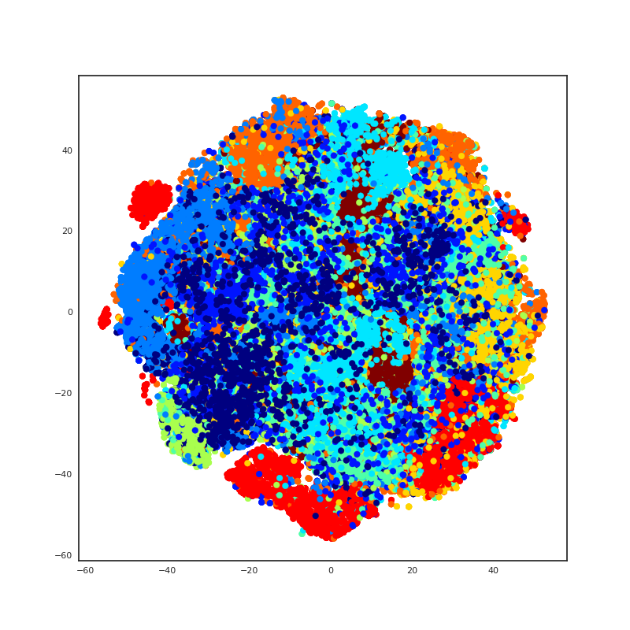
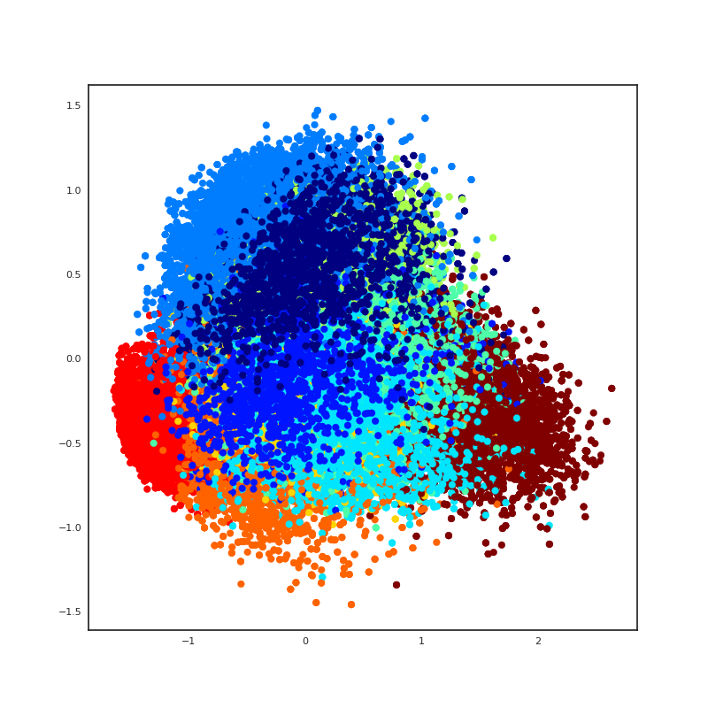
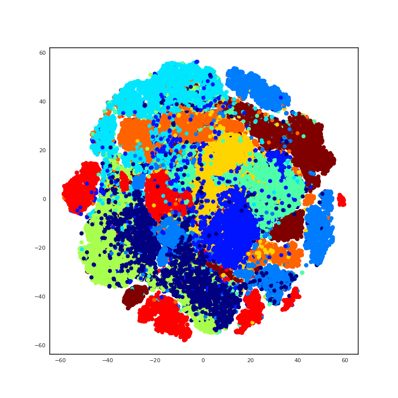

# Assignment 3

## Train simple CNN for 1 epoch only

### PCA

### tSNE

## Train simple CNN for 10 epochs
### PCA

### tSNE

## Comparisons

Features extracted from the model that was virtuality not trained at all could be expected to be almost random, however structure is not absent in the low dimensional PCA and t-SNE visualizations. In the case of PCA it is hinted in the spatial distribution where points of certain classes appear frequently in some regions, although the projection method is not able elicit separate regions. t-SNE applied to the same data does a slightly better job, but is unable produce a satisfying level of separation for the classes, except maybe for the one indicated by light red in the first t-SNE plot.

After training for ten epochs, the resulting features provide better working material for both methods to produce low-dimensional representations that visually separate the classes. The tendencies hinted at for the first application of PCA have now become more marked - clear high density regions with separate centers can be visually identified for the different classes, although the different clouds of points still show considerable overlap. We see in the final plot that t-SNE is quite successful at producing a two dimensional representation with much less mixing (tighter boudaries), although cluster of the same class are not necessarily merged or even located close to each other, e.g. both the light red class and the light blue class each show at least four separate clusters splashed out over the plot. This is as expected, as PCA and t-SNE are both unsupervised techniques that have no information of the class labels and that will merely identify patterns that allow them to find an efficient (in their own definition) low dimensional representation of the data.
